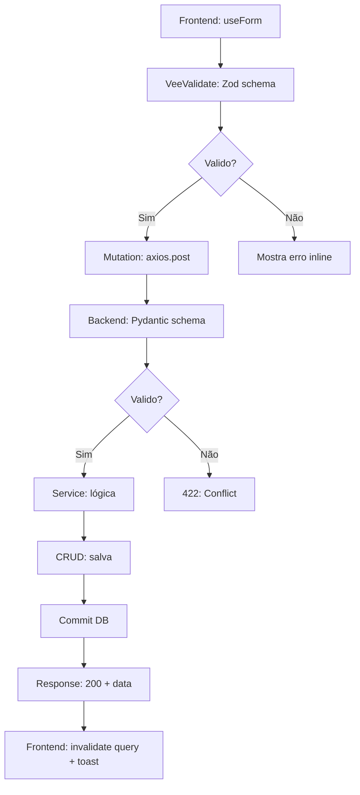

# Análise de Melhorias — Harness Engineering

**Data:** 2026-09-16
**Escopo:** Recomendações para otimizar ambiente de harness engineering

---

## 1. Adicionar Specs de API (OpenAPI/Swagger)

### Status Atual
- Sem documentação automática de endpoints
- Agentes precisam ler código para entender contratos

### Proposta
```bash
# Gerar spec OpenAPI automaticamente
# Em backend-fastapi/app/main.py:
app = FastAPI(
    title="StartBig ERP API",
    version="1.0.0",
    openapi_url="/api/v1/openapi.json"
)
```

**Benefícios:**
- ✅ Documentação sempre sincronizada com código
- ✅ Agentes IA podem consultar schema direto
- ✅ Teste de endpoints em swagger-ui (localhost:8000/docs)
- ✅ Validação automática de contrato

**Esforço:** 1-2 horas
**Prioridade:** Alta (impacta agentes de IA)

---

## 2. Adicionar Exemplos de Payload em Schemas

### Status Atual
```python
class OSCreate(BaseModel):
    numero: str
    cliente_id: int
    valor_total: int
```

Agentes não sabem os valores esperados (ex: `valor_total` deve ser positivo?).

### Proposta
```python
class OSCreate(BaseModel):
    numero: str = Field(..., min_length=1, examples=["OS-001"])
    cliente_id: int = Field(..., gt=0, examples=[1])
    valor_total: int = Field(..., gt=0, examples=[150000], description="Em centavos")

    model_config = ConfigDict(json_schema_extra={
        "example": {
            "numero": "OS-001",
            "cliente_id": 1,
            "valor_total": 150000
        }
    })
```

**Benefícios:**
- ✅ Agentes entendem tipos base (centavos vs reais)
- ✅ Swagger mostra exemplos de payload
- ✅ Reduz ambiguidade

**Esforço:** 3-4 horas (20+ schemas)
**Prioridade:** Média

---

## 3. Adicionar TypeScript Narrowing para Enums (Frontend)

### Status Atual
```typescript
type StatusOS = "aberta" | "em_progresso" | "finalizada" | "cancelada"
```

Sem garantia de sincronização com backend.

### Proposta
Criar gerador de tipos TypeScript a partir de Pydantic enums:

```bash
# scripts/generate-types-from-backend.ts
# Lê enums do backend (via schema OpenAPI) e gera tipos TypeScript

# Resultado: frontend/src/shared/types/enums.generated.ts
export const StatusOS = {
  ABERTA: "aberta",
  EM_PROGRESSO: "em_progresso",
  FINALIZADA: "finalizada",
  CANCELADA: "cancelada",
} as const;

export type StatusOS = typeof StatusOS[keyof typeof StatusOS];
```

**Benefícios:**
- ✅ Tipos sincronizados automaticamente
- ✅ Type-safe ao usar enums
- ✅ Mudanças backend = erro TypeScript imediato
- ✅ IDE autocomplete perfeito

**Esforço:** 4-6 horas
**Prioridade:** Média-Alta

---

## 4. Adicionar Fixtures e Factories para Testes

### Status Atual
- Testes duplicam dados mockados
- Difícil manter dados consistentes

### Proposta
Criar factories para backend e frontend:

```python
# backend-fastapi/test/factories.py
from factory import Factory, Faker

class UsuarioFactory(Factory):
    class Meta:
        model = Usuario

    nome = Faker('name', locale='pt_BR')
    email = Faker('email')
    cpf = Faker('cpf', locale='pt_BR')

# Uso em testes:
usuario = UsuarioFactory.create()
usuarios = UsuarioFactory.create_batch(5)
```

```typescript
// frontend/test/factories.ts
export const usuarioFactory = (overrides?: Partial<UsuarioType>) => ({
  id: Math.random(),
  nome: "João Silva",
  email: "joao@example.com",
  ...overrides,
});
```

**Benefícios:**
- ✅ Testes mais legíveis e mantíveis
- ✅ Dados realistas (faker)
- ✅ Reduz código duplicado
- ✅ Facilita testes de integração

**Esforço:** 2-3 horas
**Prioridade:** Média

---

## 5. Adicionar Script de Validação Arquitetural (Pre-Commit Hook)

### Status Atual
- Sem validação automática de regras
- Agentes precisam lembrar de todas as rules

### Proposta
```bash
# .husky/pre-commit (git hook)
#!/bin/bash

# Valida regras de arquitetura
node scripts/validate-architecture.js

# Checklist de commit
node scripts/validate-commit-message.js
```

Validações:
- ✅ Variáveis/funções em Português (regex)
- ✅ Schemas Zod + Pydantic sincronizados (detecta novo schema sem par)
- ✅ Valores monetários: `* 100` / `/ 100` presentes
- ✅ Commit message: `<tipo>(<escopo>): <desc>`
- ✅ Sem console.log (exceto src-tauri/src)
- ✅ Sem valores hardcoded de importância (porta, host)

**Esforço:** 3-4 horas
**Prioridade:** Alta (garante qualidade)

---

## 6. Adicionar Documentação de Fluxos (Diagramas)

### Status Atual
- Documentação em texto
- Agentes precisam ler código para entender fluxo

### Proposta
Usar Mermaid para diagramas em `docs/`:



**Documentar:**
- Fluxo de autenticação (login)
- Fluxo de Order Service (criação → finalização)
- Fluxo fiscal (emissão → envio NF-e)
- Arquitetura sidecar (startup → run)

**Benefícios:**
- ✅ Agentes entendem fluxo visual
- ✅ Onboarding mais rápido
- ✅ Reduz bugs de integração

**Esforço:** 2-3 horas
**Prioridade:** Baixa (nice to have)

---

## 7. Adicionar Decisões Arquiteturais (ADR)

### Status Atual
- Decisões no CLAUDE.md e memória
- Sem contexto de **por que** foram tomadas

### Proposta
Criar ADRs em `.agent/decisions/`:

```markdown
# ADR-001: Valores Monetários em Centavos

**Data:** 2026-09-16
**Status:** Accepted

## Problema
- Inconsistência: frontend trabalha em reais, backend em centavos
- Erros de arredondamento com floats

## Solução
- Backend: **sempre** centavos (inteiros)
- Frontend: reais (floats) → conversão antes de save
- API: retorna centavos

## Razões
- Evita erros de arredondamento
- Consistente com padrão internacional (moeda em unidade menor)
- Fácil validação (int > 0)

## Implicações
- Toda chamada API divide por 100 no frontend
- Testes devem validar conversão
- Docs devem deixar claro (exemplo: `1500` = R$ 15,00)

## Alternativas Consideradas
1. Decimal (Python) — complexo no frontend
2. Sempre float — risco de arredondamento

---

# ADR-002: VeeValidate + Zod em Duplica

**Status:** Accepted

## Problema
- Validação frontend é cosmética
- Backend precisa validar tudo de novo

## Solução
- Ambos usam Zod (frontend) + Pydantic (backend) com mesma lógica
- Schemas gemináveis (veja `generate-types-from-backend.ts`)

## Benefícios
- Type-safe end-to-end
- Mudanças schema forçam atualização ambos lados

---
```

**Benefícios:**
- ✅ Contexto histórico (por que essa decisão?)
- ✅ Agentes entendem trade-offs
- ✅ Evita retomar decisões já tomadas

**Esforço:** 2-3 horas (5-6 ADRs)
**Prioridade:** Média (good practice)

---

## 8. Adicionar Observabilidade (Logging + Tracing)

### Status Atual
- Logs básicos no stdout
- Sem correlação de requisições

### Proposta
```python
# backend-fastapi/app/core/logging.py
import structlog
import uuid

logger = structlog.get_logger()

# Middleware: adiciona X-Request-ID
@app.middleware("http")
async def add_request_id(request: Request, call_next):
    request_id = str(uuid.uuid4())
    request.state.request_id = request_id
    response = await call_next(request)
    response.headers["X-Request-ID"] = request_id
    logger.info("request",
        method=request.method,
        path=request.url.path,
        status_code=response.status_code,
        request_id=request_id
    )
    return response
```

Frontend:
```typescript
// Adiciona X-Request-ID em headers
axios.interceptors.request.use(config => {
  config.headers["X-Request-ID"] = generateUUID();
  return config;
});
```

**Benefícios:**
- ✅ Rastreabilidade end-to-end
- ✅ Facilita debugging
- ✅ Pronto para observabilidade (CloudWatch, DataDog)

**Esforço:** 2-3 horas
**Prioridade:** Média

---

## 9. Adicionar CI/CD Pipeline

### Status Atual
- Sem validação automática em commits
- Deploy manual

### Proposta
GitHub Actions (`.github/workflows/`):

```yaml
# ci.yml
name: CI

on: [push, pull_request]

jobs:
  lint:
    runs-on: ubuntu-latest
    steps:
      - uses: actions/checkout@v3
      - run: cd frontend && npm install && npm run lint
      - run: cd backend && pip install -r requirements.txt && pytest

  type-check:
    runs-on: ubuntu-latest
    steps:
      - uses: actions/checkout@v3
      - run: cd frontend && npx vue-tsc --noEmit

  architecture-check:
    runs-on: ubuntu-latest
    steps:
      - uses: actions/checkout@v3
      - run: node scripts/validate-architecture.js
```

**Benefícios:**
- ✅ Validação automática em PRs
- ✅ Bloqueia merge se quebrado
- ✅ Histórico de builds

**Esforço:** 2-3 horas
**Prioridade:** Alta (garante qualidade)

---

## 10. Criar Portal de Documentação (MkDocs)

### Status Atual
- Docs espalhadas (CLAUDE.md, memory/, AGENT.md)
- Sem índice central

### Proposta
```bash
# mkdocs.yml
site_name: StartBig ERP — Guia do Desenvolvedor

nav:
  - Home: index.md
  - Para Agentes IA:
    - AGENT.md
    - Regras de Arquitetura: agent/rules/architecture-communication.md
    - Padrões de Código: agent/patterns.md
  - Para Humanos:
    - Setup: CLAUDE.md
    - Troubleshooting: CLAUDE.md#troubleshooting
    - Módulos:
      - Fiscal: memory/modulo-fiscal-refatoracao.md
      - Order Service: modules/order-service/docs/order-service.md
  - Decisões:
    - ADRs: decisions/
```

```bash
mkdocs serve  # http://localhost:8000
mkdocs build  # Gera site HTML
```

**Benefícios:**
- ✅ Documentação centralizada
- ✅ Search global
- ✅ Versioning automático
- ✅ Deploy fácil (GitHub Pages)

**Esforço:** 2-4 horas
**Prioridade:** Baixa (nice to have)

---

## Priorização Recomendada

### Sprint 1 (Semana 1)
1. ✅ Specs de API (OpenAPI) — **impacto alto**
2. ✅ Pre-commit hooks — **qualidade alta**

### Sprint 2 (Semana 2)
3. TypeScript type generation — **sincronização automática**
4. Exemplos em schemas — **clareza**

### Sprint 3 (Semana 3)
5. Fixtures e factories — **testes mais rápido**
6. ADRs — **contexto histórico**

### Backlog
- Diagramas (Mermaid)
- CI/CD (GitHub Actions)
- MkDocs portal

---

## Impacto no Harness Engineering

| Melhoria | Impacto em Agentes IA | Impacto em Humanos | ROI |
|----------|----------------------|-------------------|-----|
| OpenAPI Specs | 🟢 Alto | 🟡 Médio | 🟢 Alto |
| Pre-commit hooks | 🟡 Médio | 🟢 Alto | 🟢 Alto |
| Type generation | 🟢 Alto | 🟢 Alto | 🟢 Muito Alto |
| Schema examples | 🟢 Alto | 🟡 Médio | 🟡 Médio |
| Fixtures | 🟡 Médio | 🟢 Alto | 🟡 Médio |
| ADRs | 🟢 Alto | 🟢 Alto | 🟡 Médio |
| CI/CD | 🟡 Médio | 🟢 Alto | 🟢 Alto |

---

**Próximos passos:**
1. Priorizar com o time
2. Designar implementação
3. Adicionar ao roadmap
4. Iterar baseado em feedback

